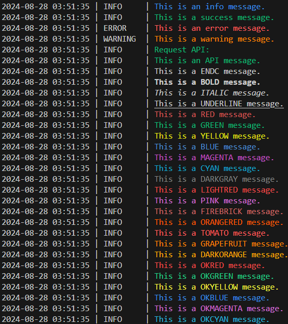

# base-project: Python 개발을 위한 기본 프로젝트 환경

본 프로젝트는 여러가지 유용한 도구들을 기반으로 하는 Python 프로젝트 환경 구축을 목표로 하고 있습니다.

## 1. 개발 환경

다양한 플랫폼에서 일관성 있는 개발 경험을 제공하기 위해 다음과 같은 환경을 설정했습니다.

- **Dev Container**: Visual Studio Code의 Dev Containers를 활용하여 일관된 개발 환경을 제공합니다.
  - 설정 파일: `.devcontainer/devcontainer.json`
- **Docker**: 배포 및 테스트를 위한 컨테이너화를 지원합니다.
  - 설정 파일: `Dockerfile`
- **Python**:
  - 프로젝트 설정: `pyproject.toml`
  - 의존성 관리: `requirements.txt`

## 2. 코어 유틸리티

`src/core/` 디렉토리에는 개발 생산성을 높이기 위한 여러 유틸리티 모듈이 포함되어 있습니다.

### 2.1 Timer

코드 실행 시간을 측정하는 기능을 제공합니다.

1. **Context manager**

   ```python
   from src.core import Timer

   with Timer("Task 1"):
       # Here is code snippet
       sleep(1)
   ```

   출력:

   ```
   * Task 1    | 1.00s (0.02m)
   ```

2. **Decorator**

   ```python
   from src.core import Timer, T

   @Timer("Task 1")
   def fn1():
       sleep(1)

   @T
   def fn2():
       sleep(1)

   fn1()
   fn2()
   ```

   출력:

   ```
   * Task 1     | 1.00s (0.02m)
   * fn2()      | 1.00s (0.02m)
   ```

### 2.2 Depth logging

함수 호출 스택을 시각화하고, 실행 시간을 측정하는 기능을 제공합니다.

```python
from src.core import D

@D
def main():
    main1()
    main2()

@D
def main1():
    main11()
    main12()

@D
def main11():
    return

@D
def main12():
    return

@D
def main2():
    main21()

@D
def main21():
    return

main()
```

출력:

```
  1            | main()
  1.1          | main1()
  1.1.1        | main11()
* 1.1.1        | 0.00s (0.00m)
  1.1.2        | main12()
* 1.1.2        | 0.00s (0.00m)
* 1.1          | 0.00s (0.00m)
  1.2          | main2()
  1.2.1        | main21()
* 1.2.1        | 0.00s (0.00m)
* 1.2          | 0.00s (0.00m)
* 1            | 0.00s (0.00m)
```

### 2.3 Logging

Console과 file에 log를 기록합니다. \
Log는 `logs/YYYY-MM-DD.log` 파일에 저장되어 쉽게 추적하고 디버깅할 수 있습니다. \
유틸리티 함수를 이용하면 간편하게 사용할 수 있습니다.

```python
from src.core import slog, log_info, log_success, log_error, log_warning, log_api
from src.core.logger import STYLES

log_info("This is an info message.")
log_success("This is a success message.")
log_error("This is an error message.")
log_warning("This is a warning message.")
log_api("This is an API message.")
for style in STYLES:
    slog(f"This is a {style} message.", style=style)
```



### 2.4 Safe HTTP requests

Error handling 및 logging을 포함하여 HTTP 요청(`requests.post`)을 안전하게 수행할 수 있습니다.

```python
from src.core import safe_post

url = "https://httpbin.org/post"
json = {"key": "value"}
response = safe_post(url, json)
```

---

이 프로젝트가 여러분의 Python 개발 경험을 향상시키는 데 도움이 되기를 바랍니다!
